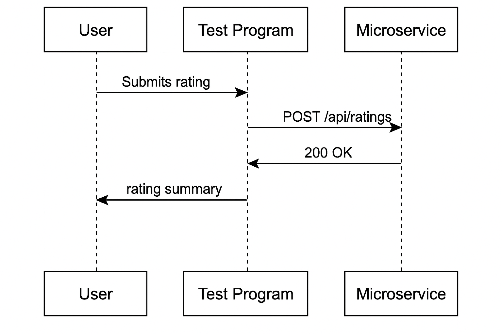

# 🚗 Driveway Rating Microservice

This REST API microservice allows renters to submit 1–5 star ratings for driveways they have used, and to retrieve average ratings for those driveways.

---
## 📡 Communication Contract
API
### 🔹 Base URL
http://localhost:4000/api/ratings


## 🔧 API Endpoints

### 🔹 Submit or Update a Rating
**POST** `/api/ratings`

**Request Body:**
```json
{
  "drivewayId": 101,
  "userId": 1001,
  "stars": 5
}
```

drivewayId: integer (required)

userId: integer < 10 (required) (Easily change this to whatever you need)

stars: integer from 1 to 5 (required)

Example Call:
fetch("http://localhost:4000/api/ratings", {
  method: "POST",
  headers: { "Content-Type": "application/json" },
  body: JSON.stringify({ drivewayId: 101, userId: 1001, stars: 5 })
});


## User Story 2 - Get Ratings Summary:
Response:

json:
{
  "average": "4.5",
  "totalVotes": 10
}
Example Call:

fetch("http://localhost:4000/api/ratings/101")
  .then(res => res.json())
  .then(console.log);

To Start:

Clone the repo: git clone https://github.com/chsee1/CS361Proj/tree/main/rating
Install the dependences: npm install
node server.js

The server is now ready for requests.

UML Diagram

